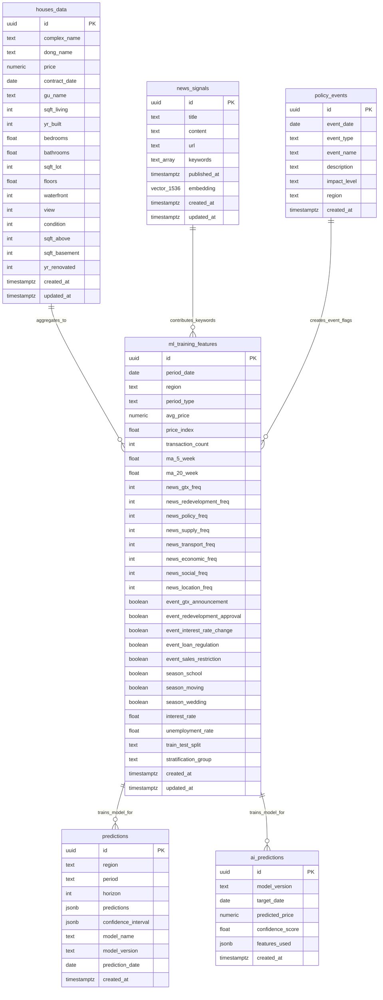
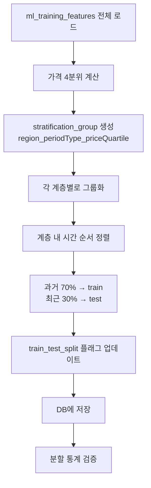

# HomeSignal AI — 데이터베이스 스키마 및 테이블 관계 문서

**문서 버전:** 1.0  
**최종 수정일:** 2026-03-09  
**참조:** `02_Architecture_Design.md`, `03_AI_Model_Pipeline.md`

---

## 1. 개요

HomeSignal AI 프로젝트는 부동산 시계열 예측과 RAG 챗봇을 위해 6개의 핵심 테이블을 사용합니다. 본 문서는 각 테이블의 스키마, 테이블 간 관계(물리적 FK vs 논리적 관계), 그리고 ML 학습을 위한 Train/Test Split 전략을 설명합니다.

---

## 2. 전체 테이블 구조 (ERD)



---

## 3. 테이블 상세 설명

### 3.1 houses_data (부동산 실거래 원본 데이터)

**목적:** 국토교통부 API에서 수집한 부동산 거래 원본 데이터 저장

| 컬럼 | 타입 | 설명 | 제약조건 |
|------|------|------|----------|
| id | UUID | 기본키 | PRIMARY KEY |
| complex_name | TEXT | 아파트 단지명 | NOT NULL |
| dong_name | TEXT | 동 이름 (예: 청량리동) | |
| price | NUMERIC(15,2) | 거래 가격 | NOT NULL, CHECK (price > 0) |
| contract_date | DATE | 계약 날짜 | NOT NULL |
| gu_name | TEXT | 구 이름 | DEFAULT '동대문구' |
| sqft_living | INT | 전용면적 (sqft) | |
| yr_built | INT | 건축 연도 | |
| bedrooms | FLOAT | 방 개수 | |
| bathrooms | FLOAT | 욕실 개수 | |
| sqft_lot | INT | 대지 면적 | |
| floors | FLOAT | 층수 | |
| waterfront | INT | 워터프론트 여부 | CHECK (waterfront IN (0, 1)) |
| view | INT | 조망 등급 | CHECK (view >= 0) |
| condition | INT | 상태 등급 | CHECK (condition >= 0) |
| sqft_above | INT | 지상 면적 | |
| sqft_basement | INT | 지하 면적 | |
| yr_renovated | INT | 리모델링 연도 | |
| created_at | TIMESTAMPTZ | 생성 시각 | DEFAULT NOW() |
| updated_at | TIMESTAMPTZ | 수정 시각 | DEFAULT NOW() |

**인덱스:**
- `houses_data_contract_date_idx` (contract_date DESC)
- `houses_data_dong_name_idx` (dong_name)
- `houses_data_complex_name_idx` (complex_name)
- `houses_data_dong_date_idx` (dong_name, contract_date DESC) - 조인 최적화

**유니크 제약:**
- `unique_transaction` (complex_name, contract_date, price) - 중복 거래 방지

---

### 3.2 news_signals (뉴스 신호 + 벡터 임베딩)

**목적:** 구글 뉴스 크롤링 데이터 + OpenAI 임베딩 저장, RAG 및 키워드 피처 생성

| 컬럼 | 타입 | 설명 | 제약조건 |
|------|------|------|----------|
| id | UUID | 기본키 | PRIMARY KEY |
| title | TEXT | 뉴스 제목 | NOT NULL |
| content | TEXT | 뉴스 본문 | |
| url | TEXT | 뉴스 URL | UNIQUE |
| keywords | TEXT[] | 추출된 키워드 배열 | DEFAULT '{}' |
| published_at | TIMESTAMPTZ | 발행 시각 | NOT NULL |
| embedding | VECTOR(1536) | OpenAI 임베딩 | |
| created_at | TIMESTAMPTZ | 생성 시각 | DEFAULT NOW() |
| updated_at | TIMESTAMPTZ | 수정 시각 | DEFAULT NOW() |

**인덱스:**
- `news_signals_embedding_idx` (embedding vector_cosine_ops) - IVFFLAT 벡터 검색
- `news_signals_published_at_idx` (published_at DESC)
- `news_signals_keywords_idx` (keywords) - GIN 인덱스
- `news_signals_published_keywords_idx` (published_at DESC) - 조인 최적화

**RPC 함수:**
- `match_news_documents(query_embedding, match_count, match_threshold, filter_keywords, filter_date_from, filter_date_to)` - 코사인 유사도 검색

---

### 3.3 policy_events (정책 이벤트 마스터 데이터)

**목적:** GTX 발표, 재개발 승인 등 주요 정책 이벤트 저장, 이벤트 더미 변수 생성에 사용

| 컬럼 | 타입 | 설명 | 제약조건 |
|------|------|------|----------|
| id | UUID | 기본키 | PRIMARY KEY |
| event_date | DATE | 이벤트 발생 날짜 | NOT NULL |
| event_type | TEXT | 이벤트 유형 (gtx_announcement, redevelopment_approval 등) | NOT NULL |
| event_name | TEXT | 이벤트 이름 | NOT NULL |
| description | TEXT | 상세 설명 | |
| impact_level | TEXT | 영향도 (low, medium, high) | CHECK (impact_level IN ('low', 'medium', 'high')) |
| region | TEXT | 영향 지역 (NULL이면 전체 지역) | |
| created_at | TIMESTAMPTZ | 생성 시각 | DEFAULT NOW() |

**인덱스:**
- `policy_events_date_idx` (event_date DESC)
- `policy_events_type_idx` (event_type)
- `policy_events_region_idx` (region)

---

### 3.4 ml_training_features (ML 학습용 통합 피처 테이블)

**목적:** Prophet + LightGBM 앙상블 모델 학습을 위한 통합 Feature 테이블

| 컬럼 | 타입 | 설명 | 제약조건 |
|------|------|------|----------|
| id | UUID | 기본키 | PRIMARY KEY |
| period_date | DATE | 기간 날짜 | NOT NULL |
| region | TEXT | 지역명 | NOT NULL |
| period_type | TEXT | 기간 타입 | NOT NULL, CHECK (period_type IN ('week', 'month')) |
| avg_price | NUMERIC(15,2) | 평균 가격 (Target 변수) | NOT NULL |
| price_index | FLOAT | 가격 지수 | |
| transaction_count | INT | 거래 건수 | |
| ma_5_week | FLOAT | 5주 이동평균 | |
| ma_20_week | FLOAT | 20주 이동평균 | |
| news_gtx_freq | INT | GTX 키워드 빈도 | DEFAULT 0 |
| news_redevelopment_freq | INT | 재개발 키워드 빈도 | DEFAULT 0 |
| news_policy_freq | INT | 정책 키워드 빈도 | DEFAULT 0 |
| news_supply_freq | INT | 공급 키워드 빈도 | DEFAULT 0 |
| news_transport_freq | INT | 교통 키워드 빈도 | DEFAULT 0 |
| news_economic_freq | INT | 경제 키워드 빈도 | DEFAULT 0 |
| news_social_freq | INT | 사회 키워드 빈도 | DEFAULT 0 |
| news_location_freq | INT | 지역 키워드 빈도 | DEFAULT 0 |
| event_gtx_announcement | BOOLEAN | GTX 발표 이벤트 | DEFAULT FALSE |
| event_redevelopment_approval | BOOLEAN | 재개발 승인 이벤트 | DEFAULT FALSE |
| event_interest_rate_change | BOOLEAN | 금리 변동 이벤트 | DEFAULT FALSE |
| event_loan_regulation | BOOLEAN | 대출 규제 이벤트 | DEFAULT FALSE |
| event_sales_restriction | BOOLEAN | 분양 규제 이벤트 | DEFAULT FALSE |
| season_school | BOOLEAN | 개학 시즌 (2-3월, 8-9월) | DEFAULT FALSE |
| season_moving | BOOLEAN | 이사 시즌 (1-2월, 12월) | DEFAULT FALSE |
| season_wedding | BOOLEAN | 결혼 시즌 (5월, 10월) | DEFAULT FALSE |
| interest_rate | FLOAT | 기준 금리 | |
| unemployment_rate | FLOAT | 실업률 | |
| **train_test_split** | TEXT | **학습/평가 분할 플래그** | CHECK (train_test_split IN ('train', 'test', 'validation')) |
| **stratification_group** | TEXT | **계층화 그룹 (지역_기간_가격분위)** | |
| created_at | TIMESTAMPTZ | 생성 시각 | DEFAULT NOW() |
| updated_at | TIMESTAMPTZ | 수정 시각 | DEFAULT NOW() |

**인덱스:**
- `ml_training_features_region_date_idx` (region, period_date DESC)
- `ml_training_features_period_type_idx` (period_type)
- `ml_training_features_period_date_idx` (period_date DESC)
- `ml_training_features_split_idx` (train_test_split, region, period_date)
- `ml_training_features_stratification_idx` (stratification_group)

**유니크 제약:**
- `unique_feature_row` (region, period_date, period_type) - 중복 피처 행 방지

**RPC 함수:**
- `get_latest_features(p_region, p_period_type, p_limit)` - 최신 N개 피처 조회
- `get_train_features(p_region, p_period_type, p_limit)` - Train 데이터만 조회
- `get_test_features(p_region, p_period_type, p_limit)` - Test 데이터만 조회
- `get_split_statistics()` - 분할 통계 조회

---

### 3.5 predictions (모델 예측 결과 저장)

**목적:** Prophet + LightGBM 앙상블 모델의 예측 결과를 저장하여 API에서 재사용

| 컬럼 | 타입 | 설명 | 제약조건 |
|------|------|------|----------|
| id | UUID | 기본키 | PRIMARY KEY |
| region | TEXT | 예측 지역 | NOT NULL |
| period | TEXT | 예측 기간 | NOT NULL, CHECK (period IN ('week', 'month')) |
| horizon | INT | 예측 기간 수 | NOT NULL, CHECK (horizon > 0) |
| predictions | JSONB | 예측 결과 배열 | NOT NULL |
| confidence_interval | JSONB | 신뢰 구간 | |
| model_name | TEXT | 모델 이름 | NOT NULL |
| model_version | TEXT | 모델 버전 | |
| prediction_date | DATE | 예측 시작 날짜 (자동 계산) | |
| created_at | TIMESTAMPTZ | 생성 시각 | DEFAULT NOW() |

**인덱스:**
- `predictions_region_date_idx` (region, prediction_date DESC)

**트리거:**
- `set_predictions_date_trigger` - predictions JSONB의 첫 항목에서 date 추출하여 prediction_date 자동 설정

---

### 3.6 ai_predictions (Ingest API 전용 예측)

**목적:** 외부 모델이나 배치 작업에서 생성한 예측 결과를 Ingest API를 통해 저장

| 컬럼 | 타입 | 설명 | 제약조건 |
|------|------|------|----------|
| id | UUID | 기본키 | PRIMARY KEY |
| model_version | TEXT | 모델 버전 | NOT NULL |
| target_date | DATE | 예측 대상 날짜 | NOT NULL |
| predicted_price | NUMERIC(15,2) | 예측 가격 | NOT NULL |
| confidence_score | FLOAT | 신뢰도 점수 | NOT NULL, CHECK (confidence_score >= 0.0 AND confidence_score <= 1.0) |
| features_used | JSONB | 사용된 피처 메타데이터 | |
| created_at | TIMESTAMPTZ | 생성 시각 | DEFAULT NOW() |

**인덱스:**
- `ai_predictions_target_date_idx` (target_date DESC)
- `ai_predictions_model_version_idx` (model_version)

---

## 4. 테이블 간 관계 (Relationships)

### 4.1 물리적 FK vs 논리적 관계

HomeSignal AI의 테이블 관계는 **집계 관계**가 대부분이므로, 물리적 Foreign Key 제약을 최소화하고 논리적 관계로 관리합니다.

| 관계 | 유형 | 이유 |
|------|------|------|
| houses_data → ml_training_features | 논리적 (집계) | N개 거래 → 1개 피처 행 (1:N 역관계) |
| news_signals → ml_training_features | 논리적 (집계) | 키워드 빈도 집계 |
| policy_events → ml_training_features | 논리적 (참조) | 이벤트 더미 변수 생성 |
| ml_training_features → predictions | 논리적 (모델 학습) | 피처로 학습 → 예측 생성 |
| ml_training_features → ai_predictions | 논리적 (모델 학습) | 피처로 학습 → 예측 생성 |

### 4.2 관계별 상세 설명

#### 4.2.1 houses_data → ml_training_features (집계 관계)

**관계:** N개의 `houses_data` 거래 → 1개의 `ml_training_features` 행

**연결 조건:**
```sql
-- 특정 지역, 특정 기간의 거래를 집계하여 피처 생성
SELECT 
    hd.dong_name AS region,
    DATE_TRUNC('week', hd.contract_date) AS period_date,
    AVG(hd.price) AS avg_price,
    COUNT(*) AS transaction_count
FROM houses_data hd
WHERE hd.dong_name = '청량리동'
  AND hd.contract_date BETWEEN '2024-01-01' AND '2024-12-31'
GROUP BY hd.dong_name, DATE_TRUNC('week', hd.contract_date);
```

**데이터 흐름:**
1. `houses_data`에 원본 거래 데이터 저장 (Ingest API)
2. `scripts/generate_ml_features.py`가 주/월 단위로 집계
3. 집계 결과를 `ml_training_features`에 저장

**무결성 검증:**
- `ml_training_features.region`이 `houses_data.dong_name`에 존재하는지 확인
- `ml_training_features.transaction_count > 0`인지 확인

---

#### 4.2.2 news_signals → ml_training_features (키워드 집계 관계)

**관계:** N개의 `news_signals` → 1개의 `ml_training_features` 행의 키워드 빈도 컬럼

**연결 조건:**
```sql
-- 특정 기간의 GTX 키워드 빈도 집계
SELECT 
    COUNT(*) AS news_gtx_freq
FROM news_signals ns
WHERE ns.published_at BETWEEN '2024-01-01' AND '2024-01-07'
  AND 'GTX' = ANY(ns.keywords);
```

**데이터 흐름:**
1. `news_signals`에 뉴스 데이터 저장 (Crawler → Ingest API)
2. `scripts/generate_ml_features.py`가 키워드 빈도 집계
3. 집계 결과를 `ml_training_features.news_*_freq` 컬럼에 저장

**무결성 검증:**
- `ml_training_features.news_*_freq >= 0` 확인
- 키워드 정의는 `config/keywords.yaml`과 일치하는지 확인

---

#### 4.2.3 policy_events → ml_training_features (이벤트 더미 변수)

**관계:** N개의 `policy_events` → 1개의 `ml_training_features` 행의 이벤트 더미 컬럼

**연결 조건:**
```sql
-- 특정 기간에 GTX 발표 이벤트가 있었는지 확인
SELECT 
    EXISTS(
        SELECT 1 FROM policy_events pe
        WHERE pe.event_type = 'gtx_announcement'
          AND pe.event_date BETWEEN '2024-01-01' AND '2024-01-07'
          AND (pe.region IS NULL OR pe.region = '청량리동')
    ) AS event_gtx_announcement;
```

**데이터 흐름:**
1. `policy_events`에 정책 이벤트 수동 입력 (또는 크롤링)
2. `scripts/generate_ml_features.py`가 이벤트 존재 여부 확인
3. 결과를 `ml_training_features.event_*` 컬럼에 TRUE/FALSE 저장

**무결성 검증:**
- `ml_training_features.event_* = TRUE`인 행에 대응하는 `policy_events` 존재 확인

---

#### 4.2.4 ml_training_features → predictions (모델 학습 → 예측 생성)

**관계:** `ml_training_features`로 모델 학습 → `predictions`에 예측 결과 저장

**연결 조건:**
```sql
-- 특정 지역의 피처로 학습한 모델이 생성한 예측
SELECT 
    p.region,
    p.prediction_date,
    p.predictions
FROM predictions p
WHERE p.region = '청량리동'
  AND p.model_name = 'prophet_lightgbm_ensemble'
ORDER BY p.created_at DESC
LIMIT 1;
```

**데이터 흐름:**
1. `scripts/train_forecast_model.py`가 `ml_training_features` 로드
2. Prophet + LightGBM 학습
3. 예측 결과를 `predictions` 테이블에 저장

**무결성 검증:**
- `predictions.region`이 `ml_training_features.region`에 존재하는지 확인
- `predictions.prediction_date`가 학습 데이터 범위 이후인지 확인

---

#### 4.2.5 ml_training_features → ai_predictions (모델 학습 → 예측 생성)

**관계:** `ml_training_features`로 모델 학습 → `ai_predictions`에 예측 결과 저장 (Ingest API 경로)

**연결 조건:**
```sql
-- 특정 날짜의 예측 결과
SELECT 
    ap.target_date,
    ap.predicted_price,
    ap.confidence_score,
    ap.features_used
FROM ai_predictions ap
WHERE ap.target_date = '2024-12-31'
  AND ap.model_version = 'v1.0'
ORDER BY ap.created_at DESC
LIMIT 1;
```

**데이터 흐름:**
1. 외부 배치 작업이 `ml_training_features`로 모델 학습
2. 예측 결과를 Ingest API (`POST /api/v1/ingest/predictions`)로 전송
3. `ai_predictions` 테이블에 저장

---

## 5. Train/Test Split 전략

### 5.1 계층화 분할 (Stratified Split)

**목적:** 지역별, 가격대별 분포를 유지하면서 시간 순서를 보존하는 분할

**전략:**
1. **Stratification Key**: `region` + `period_type` + `price_quartile`
   - `price_quartile`: `avg_price`를 4분위로 나눔 (Q1, Q2, Q3, Q4)
   - 예: `청량리동_week_Q2`

2. **Split Ratio**: Train 70%, Test 30%

3. **시간 순서 보존**: 각 계층 내에서 시간 순서대로 분할
   - Train: 과거 70% (예: 2024-01-01 ~ 2024-09-01)
   - Test: 최근 30% (예: 2024-09-02 ~ 2024-12-31)

### 5.2 분할 프로세스



### 5.3 분할 실행 방법

```bash
# 전체 데이터 분할 (모든 지역, 모든 기간 타입)
uv run python scripts/split_train_test_data.py

# 특정 지역만 분할
uv run python scripts/split_train_test_data.py --region 청량리동

# 특정 기간 타입만 분할
uv run python scripts/split_train_test_data.py --period-type month

# 8:2 비율로 분할
uv run python scripts/split_train_test_data.py --train-ratio 0.8

# Dry-run (DB 업데이트 없이 통계만 확인)
uv run python scripts/split_train_test_data.py --dry-run

# 분할 통계 조회
uv run python scripts/split_train_test_data.py --verify-only
```

### 5.4 분할 검증

**자동 검증 항목:**
1. Train/Test 비율이 각 계층에서 70:30인지 확인
2. 시간 순서 보존: Test의 최소 날짜 >= Train의 최대 날짜
3. 전체 데이터 수 = Train + Test
4. 모든 계층에 최소 1개의 Test 데이터 존재

**수동 검증 쿼리:**
```sql
-- 분할 통계 조회
SELECT * FROM get_split_statistics();

-- 특정 지역의 Train/Test 데이터 확인
SELECT 
    train_test_split,
    COUNT(*) AS count,
    MIN(period_date) AS min_date,
    MAX(period_date) AS max_date
FROM ml_training_features
WHERE region = '청량리동' AND period_type = 'week'
GROUP BY train_test_split;
```

---

## 6. 조인 쿼리 예시

### 6.1 특정 지역의 피처 생성 과정 추적

```sql
-- 청량리동 2024-01-01 주간 피처가 어떤 거래에서 집계되었는지 확인
SELECT 
    mtf.period_date,
    mtf.avg_price,
    mtf.transaction_count,
    hd.complex_name,
    hd.price,
    hd.contract_date
FROM ml_training_features mtf
LEFT JOIN houses_data hd 
    ON hd.dong_name = mtf.region
    AND hd.contract_date BETWEEN mtf.period_date AND (mtf.period_date + INTERVAL '6 days')
WHERE mtf.region = '청량리동'
  AND mtf.period_type = 'week'
  AND mtf.period_date = '2024-01-01'
ORDER BY hd.contract_date;
```

### 6.2 특정 기간의 뉴스 키워드 빈도 확인

```sql
-- 2024-01-01 주간 GTX 키워드 빈도가 어떤 뉴스에서 집계되었는지 확인
SELECT 
    mtf.period_date,
    mtf.news_gtx_freq,
    ns.title,
    ns.published_at,
    ns.keywords
FROM ml_training_features mtf
LEFT JOIN news_signals ns 
    ON ns.published_at BETWEEN mtf.period_date AND (mtf.period_date + INTERVAL '6 days')
    AND 'GTX' = ANY(ns.keywords)
WHERE mtf.region = '청량리동'
  AND mtf.period_type = 'week'
  AND mtf.period_date = '2024-01-01'
ORDER BY ns.published_at;
```

### 6.3 이벤트 더미 변수 추적

```sql
-- GTX 발표 이벤트가 어떤 피처 행에 반영되었는지 확인
SELECT 
    mtf.period_date,
    mtf.region,
    mtf.event_gtx_announcement,
    pe.event_date,
    pe.event_name,
    pe.description
FROM ml_training_features mtf
LEFT JOIN policy_events pe 
    ON pe.event_type = 'gtx_announcement'
    AND pe.event_date BETWEEN mtf.period_date AND (mtf.period_date + INTERVAL '6 days')
    AND (pe.region IS NULL OR pe.region = mtf.region)
WHERE mtf.event_gtx_announcement = TRUE
ORDER BY mtf.period_date DESC;
```

### 6.4 Train 데이터만 조회하여 모델 학습

```sql
-- Train 데이터만 조회 (RPC 함수 사용)
SELECT * FROM get_train_features('청량리동', 'week', NULL);

-- 또는 직접 쿼리
SELECT *
FROM ml_training_features
WHERE region = '청량리동'
  AND period_type = 'week'
  AND train_test_split = 'train'
ORDER BY period_date ASC;
```

### 6.5 Test 데이터로 모델 평가

```sql
-- Test 데이터만 조회 (RPC 함수 사용)
SELECT * FROM get_test_features('청량리동', 'week', NULL);

-- 또는 직접 쿼리
SELECT *
FROM ml_training_features
WHERE region = '청량리동'
  AND period_type = 'week'
  AND train_test_split = 'test'
ORDER BY period_date ASC;
```

---

## 7. 데이터 무결성 검증

### 7.1 고아 레코드 (Orphaned Records) 검증

```sql
-- ml_training_features의 region이 houses_data에 존재하지 않는 경우
SELECT DISTINCT mtf.region
FROM ml_training_features mtf
WHERE NOT EXISTS (
    SELECT 1 FROM houses_data hd
    WHERE hd.dong_name = mtf.region
);

-- ml_training_features의 이벤트 더미가 TRUE인데 policy_events에 없는 경우
SELECT 
    mtf.period_date,
    mtf.region,
    mtf.event_gtx_announcement
FROM ml_training_features mtf
WHERE mtf.event_gtx_announcement = TRUE
  AND NOT EXISTS (
      SELECT 1 FROM policy_events pe
      WHERE pe.event_type = 'gtx_announcement'
        AND pe.event_date BETWEEN mtf.period_date AND (mtf.period_date + INTERVAL '6 days')
        AND (pe.region IS NULL OR pe.region = mtf.region)
  );
```

### 7.2 자동 검증 스크립트

`scripts/validate_data_integrity.py` 스크립트를 사용하여 자동 검증:

```bash
# 전체 무결성 검증
uv run python scripts/validate_data_integrity.py

# 특정 테이블만 검증
uv run python scripts/validate_data_integrity.py --table ml_training_features

# 상세 리포트 출력
uv run python scripts/validate_data_integrity.py --verbose
```

---

## 8. 인덱스 전략

### 8.1 조인 성능 최적화

| 테이블 | 인덱스 | 목적 |
|--------|--------|------|
| houses_data | (dong_name, contract_date DESC) | 지역별 시계열 집계 최적화 |
| news_signals | (published_at DESC) | 시간 범위 필터링 최적화 |
| news_signals | (keywords) GIN | 키워드 배열 검색 최적화 |
| ml_training_features | (train_test_split, region, period_date) | Train/Test 필터링 최적화 |
| ml_training_features | (stratification_group) | 계층별 집계 최적화 |
| policy_events | (event_date DESC, event_type) | 이벤트 조회 최적화 |

### 8.2 인덱스 사용 예시

```sql
-- 인덱스 사용 확인 (EXPLAIN ANALYZE)
EXPLAIN ANALYZE
SELECT *
FROM ml_training_features
WHERE train_test_split = 'train'
  AND region = '청량리동'
  AND period_type = 'week'
ORDER BY period_date ASC;

-- 예상 결과: ml_training_features_split_idx 사용
```

---

## 9. 마이그레이션 실행 순서

### 9.1 초기 설정 (신규 프로젝트)

```bash
# 1. Supabase SQL Editor에서 마이그레이션 실행
# migrations/001_setup_pgvector.sql
# migrations/004_create_ml_features_tables.sql
# migrations/005_add_train_test_split.sql

# 2. 데이터 수집
uv run python -m src.crawler.cli crawl  # 뉴스 크롤링
# 국토교통부 API 연동 (TODO)

# 3. 피처 생성
uv run python scripts/generate_ml_features.py

# 4. Train/Test 분할
uv run python scripts/split_train_test_data.py

# 5. 모델 학습
uv run python scripts/train_forecast_model.py
```

### 9.2 기존 프로젝트 업데이트

```bash
# 1. 새 마이그레이션만 실행
# migrations/005_add_train_test_split.sql (Supabase SQL Editor)

# 2. 기존 데이터에 분할 플래그 추가
uv run python scripts/split_train_test_data.py

# 3. 검증
uv run python scripts/split_train_test_data.py --verify-only
uv run python scripts/validate_data_integrity.py

# 4. 모델 재학습
uv run python scripts/train_forecast_model.py
```

---

## 10. 향후 확장 계획

### 10.1 Cross-Validation 지원

`ml_training_features`에 `fold_number` 컬럼 추가:

```sql
ALTER TABLE ml_training_features 
ADD COLUMN fold_number INT CHECK (fold_number >= 0);
```

K-Fold Cross-Validation 시 각 Fold를 구분하여 저장 가능.

### 10.2 모델 버전 관리

`predictions`와 `ai_predictions`의 `model_version` 컬럼을 활용하여 여러 모델 버전 비교:

```sql
-- 모델 버전별 성능 비교
SELECT 
    model_version,
    AVG(confidence_score) AS avg_confidence,
    COUNT(*) AS prediction_count
FROM ai_predictions
GROUP BY model_version
ORDER BY avg_confidence DESC;
```

### 10.3 임대(전세/월세) 데이터 추가

`houses_data`에 `deal_type` 컬럼 추가하여 매매/전세/월세 구분:

```sql
ALTER TABLE houses_data 
ADD COLUMN deal_type TEXT CHECK (deal_type IN ('sale', 'jeonse', 'monthly_rent'));
```

---

## 11. 참고 자료

| 문서 | 내용 |
|------|------|
| `migrations/001_setup_pgvector.sql` | houses_data, news_signals, predictions, ai_predictions 테이블 생성 |
| `migrations/004_create_ml_features_tables.sql` | ml_training_features, policy_events 테이블 생성 |
| `migrations/005_add_train_test_split.sql` | train_test_split, stratification_group 컬럼 추가 |
| `scripts/generate_ml_features.py` | 피처 생성 스크립트 |
| `scripts/split_train_test_data.py` | Train/Test 분할 스크립트 |
| `scripts/train_forecast_model.py` | 모델 학습 스크립트 |
| `scripts/validate_data_integrity.py` | 무결성 검증 스크립트 |
| `docs/12_Vector_DB_Setup_Guide.md` | Vector DB 설정 가이드 |

---

## 12. 요약

### 12.1 테이블 관계 요약

| From | To | 관계 유형 | 설명 |
|------|----|-----------|----|
| houses_data | ml_training_features | 논리적 (집계) | 거래 데이터 → 주/월 평균 가격 |
| news_signals | ml_training_features | 논리적 (집계) | 뉴스 → 키워드 빈도 |
| policy_events | ml_training_features | 논리적 (참조) | 이벤트 → 더미 변수 |
| ml_training_features | predictions | 논리적 (학습) | 피처 → 예측 결과 |
| ml_training_features | ai_predictions | 논리적 (학습) | 피처 → 예측 결과 |

### 12.2 Train/Test Split 요약

- **방법**: 계층화 분할 (Stratified Split) + 시간 순서 보존
- **비율**: Train 70%, Test 30%
- **계층화 키**: region + period_type + price_quartile (4분위)
- **저장 위치**: `ml_training_features.train_test_split` 컬럼
- **검증**: `get_split_statistics()` RPC 함수

### 12.3 핵심 설계 원칙

1. **집계 관계는 FK 제약 없이 논리적 관계로 관리** - 성능 최적화
2. **인덱스로 조인 성능 보장** - 물리적 FK 대신 인덱스 최적화
3. **애플리케이션 레벨 검증** - 데이터 생성 스크립트에서 무결성 검증
4. **시간 순서 보존** - 시계열 데이터 특성상 과거 학습, 미래 평가
5. **계층화로 분포 유지** - 지역/가격대별 편향 방지

---

**다음 문서:** 모델 학습 및 배포 가이드 참조 (`03_AI_Model_Pipeline.md`, `05_Deployment_Operation.md`)
